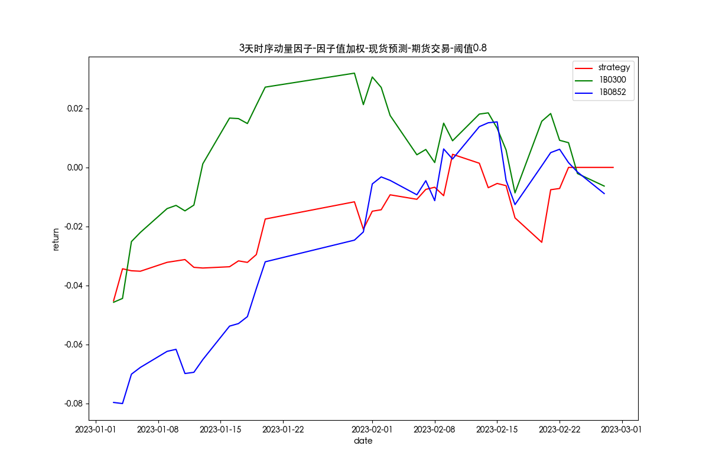

2022-02-23
----

### 一、概览
- factor_pool.py，因子池
- factor_weights.py，因子加权方式
- log，交易日志
- _backtest.py，因子回测逻辑

### 二、回测细节
- 使用现货数据计算因子值，使用期货主力合约数据进行回测交易
- T天开盘价开仓，收盘价平仓
- 保证金8%，开仓手续费万0.23，平今仓手续费万3.45

### 三、截面动量因子
#### 因子计算方式：
- 计算沪深300指数、中证1000指数每日的对数收益率：
  $ret_t = ln(\frac{close_t}{close_{t-1}})$
- 计算周期N天内对数收益率的累计值作为因子值：
  ${factor\_value}_t = \sum_{i=1}^{N}ret_i$

#### 因子回测逻辑
等权做多因子值大的股指主力合约，做空因子值小的股指主力合约。当股指因子值相差小于阈值时，延续上一个交易日的交易策略。

#### 回测结果
##### N=3，阈值为0

##### N=3，阈值为0.2

##### N=3，阈值为0.8

##### N=10，阈值为0

##### N=10，阈值为0.2

##### N=10，阈值为0.8

##### 异常值分析，2022-11-08
中证1000主力合约出现乌龙指

2022-11-08中证1000开盘情况

2022-11-08当天回测交易情况
- 3天截面动量因子，阈值0.8

- 3天截面动量因子，不进行阈值限制

### 四、时序动量因子
#### 因子计算方式：
- 计算主力合约每日的线性收益率
$ret_t = \frac{close_t}{close_{t-1}}-1$
- 计算N天内线性收益率的累计值与前N天收益率波动率的比值，N为回溯期长度
$factor\_value_t = \sum_{i=1}^N \frac{ret_{t-i}}{\sigma_N^2}$

#### 因子回测逻辑
做多因子值为正的股指主力合约，做空因子值为负的股指主力合约。当因子值同正负时，做多因子值大的主力合约，做空因子值小的主力合约。使用因子值进行加权。

#### 回测结果
##### N=3，阈值为0

##### N=3，阈值为0.2

##### N=3，阈值为0.8

##### N=10，阈值为0

##### N=10，阈值为0.2

##### N=10，阈值为0.8
